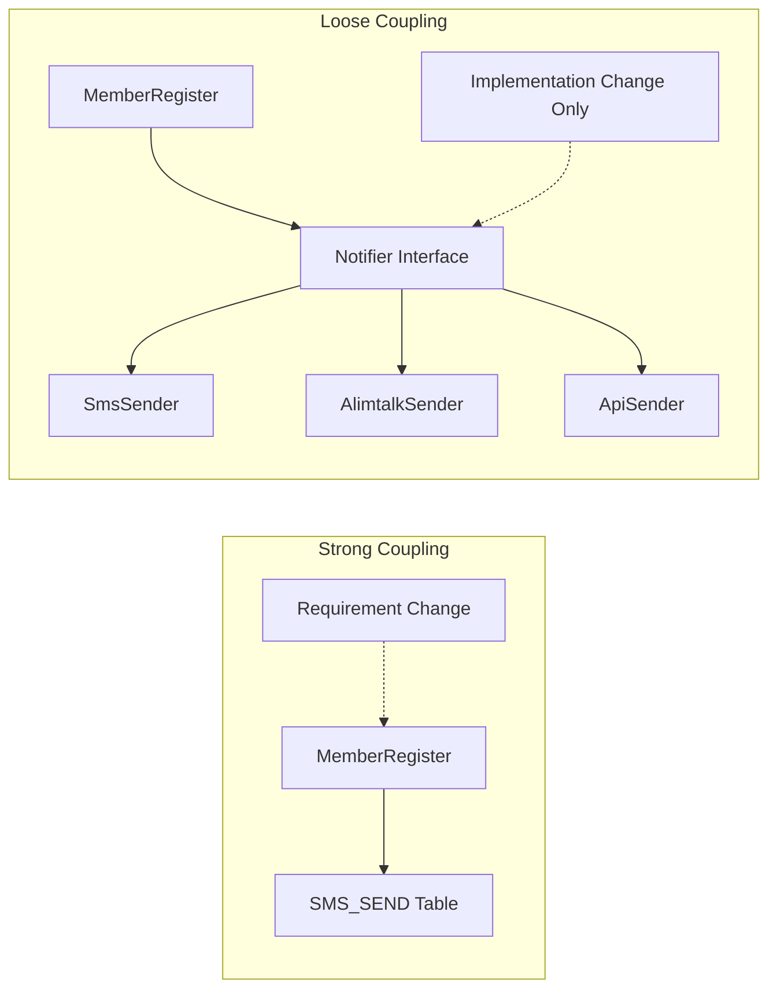

# 응집도와 결합도

응집도: 모듈 안에 있는 요소가 함께 모여있는 정도, 한 모듈의 파트가 동일한 모듈 안에 얼마나 포함되어 있는지를 나타낸다.

- 회원 관련 코드가 한 패키지 (또는 한 모듈)에 모여있는가?
- 스택 관련 코드가 한 클래스에 모여 있는가?
- 폼 검증 로직이 한 함수에 모여 있는가?

관련 코드가 한곳에 모여있다 (응집도가 높다)
관련 코드가 여러 곳에 분산되어 있다 (응집도가 낮다)

MemberService가 회원 가입, 회원 정보 변경, 암호 변경, 회원 탈퇴 등의 기능을 구현하면 한 클래스에 뒤섞여서 응집도 가 떨어진다.
=> 회원 가입을 위한 클래스, 회원 정보 변경을 위한 클래스, 암호 변경을 위한 클래스, 회원 탈퇴를 위한 클래스

### 응집도가 높으면 왜 좋은가요?

역할에 따라 클래스가 분리되면서 자연스럽게 클래스 길이가 줄어든다.
가독성이 좋아진다.
코드 분석 시간을 줄여준다.
기능 변경 시 수정할 범위가 줄어든다.

## 응집도, 역할, 수정 범위

응집도는 역할 또는 책임과 관련이 있다.
응집도가 높다: 구성 요소가 역할에 따라 알맞게 분리 될 가능성이 커진다. 구성 요소를 수정하려는 이유도 하나로 줄어든다.

ex. 모든 회원 관련 타입은 member 패키지에 존재하고, 계약 관련 타입은 contract 패키지에 존재한다. 회원 관련 기능을 변경해야한다면 member 패키지의 코드만 수정하면 된다.

> 단일 책임 원칙
> 구성 요소는 하나의 책임만 가져야 한다는 원칙
> 구성 요소를 수정할 이유는 하나여야한다는 것이다. 응집도를 높이려면 역할에 따라 구성요소를 나눠야하는데 역할에 맞게 구성 요소를 나누면 각 구성 요소를 수정할 이유가 줄어들게된다.
> 응집도가 높다 = 단일 책임 원칙을 따를 가능성이 높다

## 캡슐화와 응집도

객체 지향에서 캡슐화는 데이터와 함수를 한곳에 모은다. (데이터를 외부에 노출하지 않고 감추는 정보 은닉과 캡슐화를 구분해서 표현할 수도 있지만, 흔히 말하는 캡슐화는 정보 은닉을 포함한다.)

캡슐화는 응집도를 높이는 방법의 하나다.
데이터에 대한 직접 접근을 최소화해서 구현을 감추고 외부에 기능을 제공한다.
이렇게 구현하면 구현을 변경해야할 때 수정 범위가 캡슐화한 객체로 좁혀진다.

```java
public class Member {
    private LocalDate expiry;
}
```

```java
// 회원이 만료었는지 판단하기 위한 코드
Member m = getMember(id);
if(m.getExpiry().isBefore(LocalDate.now())){
    ...
}
```

만일 만료일을 무한대로 제공해야할 필요가 있어 expiry를 null로 저장하기로 했다면, getExpiry()를 사용한 모든 코드를 변경해야한다.

```java
public class Member {
    private LocalDate expiry;

    public boolean isExpired(){
        return expiry.isBefore(LocalDate.now());
    }

}
```

위외 같이 캡슐화 했다면 수정 포인트는 하나가 된다.

# 결합도

> 결합도는 소프트웨어 모듈이 서로 의존하는 정도이다.
> 두 모듈이 얼마나 밀접하게 연결되어 있는지 모듈 간 관계 정도를 나타낸다.

한 요소를 수정할 때 다른 요소도 함께 수정해야 하면 두 요소 간의 결합도가 높다고 한다.
한 요소를 수정할 때 다른 모듈을 수정하지 않아도 되면 결합도가 낮다고 한다.

결합도가 높을수록 유지보수 비용이 증가한다.

응집도를 높이고 결합도를 낮추려면 구성 요소 간 상호작용을 최소화 해야한다.
캡슐화는 구현을 감추고 두 구성 요소 간의 상호 작용을 줄여주어 응집도 높이는 동시에 결합도를 낮춰준다.

## 추상화 타입과 결합도

추상화 타입을 사용해 결합도를 낮출 수 있다.



## 이벤트와 결합도

이벤트를 사용하면 결합도를 낮출 수 있다.
회원에게 SMS로 통지하는 코드를 이벤트 리스너로 분리힌다.

```java

public class MemberEventListener{
    public void handle(MemberRegisteredEvent event){
        // SMS 전송 코드
    }
}
```

이벤트를 발생시킨 주체에 대한 직접적인 의존을 없앴다.

## 추상화, 이벤트와 코드 추적

하지만, 추상화 타입과 이벤트를 사용하면 두 코드가 직접 연결되지 않고 간접적으로 연결되기때문에 코드를 분석하는데 더 많은 노력이 들어간다. 새로운 타입이 추가되어 구조도 약간 복잡해진다.
다라서 추상화나 이벤트를 적용할 때는 결합도 감소, 응집도 증가, 변경 비용 감소, 테스트 가능성 등 얻을 수 있는 이점을 따져보고, 이점이 별로 없다면 추상화 타입을 사용하지 않고 구현만 분리해서 응집도를 높이는 것도 좋은 선택이 될 수 있다.

## 결합 유형

결합은 다양한 형태로 존재하기 때문에, 어떤 형태의 결합이 존재하는지 알면 결합도를 높이지 않는 방향으로 코드를 작성하는데 도움이 된다.

1. 공통 결합

- 여러 모듈이 동일한 글로벌 데이터에 접근할 때 발생
  ex. 고객 데이터를 회원 모듈, 주문 모듈, 상품 모듈에서 직접 접근하여 변경할 수 있다면 공통 결합이라고 할 수 있다.

2. 제어 결합 (control coupling)

- 한 모듈이 다른 모듈의 흐름을 제어할 때 발생하는 결합
  ex. 계약 취소 메서드의 경우, 파라미터로 전달 받은 값이 Y인지에 따라 취소를 확정 로직을 수행한다. 즉, 무엇을 전달하는지에 따라 메서드의 동작이 달라진다.

3. 하위 클래스 결합

- 하위 클래스와 상위 클래스 간의 관계로, 상위 클래스는 하위 클래스에 의존하지 않지만 하위 클래스는 상위 클래스에 의존한다. 상위 클래스 기능을 사용하는 하위 클래스가 많아지면, 상위 클래스를 수정하기 어려워진다.

3. 시간적 결합 (temporal coupling)

- 함께 실행하는 두 기능을 한 모듈에 결합
  ex. 회원 데이터를 저장하는 기능과 문자를 전송하는 기능을 함께 실행하기 위해 회원 가입 기능에 묶여있다면 시간적 결합이라고 할 수 있다.

4. 논리 결합 (logical coupling) / 변경 결합 (change coupling)

- 두 모듈 간의 변경 패턴이 존재할 때 발생한다.
  ex. 회원 시스템에서 회원 이메일 주소를 변경했을 때, 포인트 시스템의 이메일 주소도 함께 변경해야하면 두 시스템은 논리적으로 결합하고 있다고 할 수 있다.
