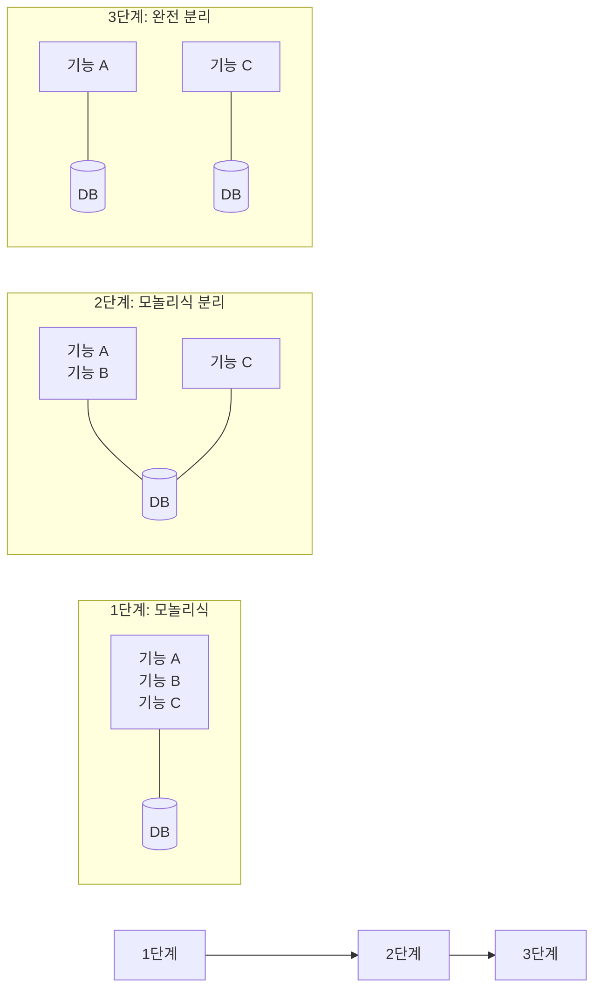
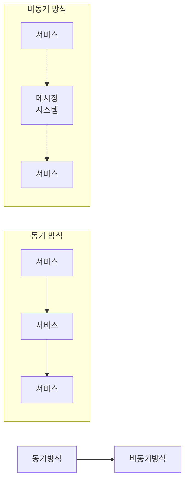

# 아키텍처, 패턴

주니어 개발자와 중간,시니어 개발자를 구분짓는 요소 중 하나로 아키텍처 설계 역량을 꼽을 수 있다.

## 아키텍처 고민하기

소프트웨어 시스템의 추상적인 구조.
소프트웨어 요소, 요소 간의 관계, 요소와 관계의 속성(프로퍼티)로 구성된다.

- 시스템 수준 아키텍처 : 마이크로서비스
- 클래스 수준의 아키텍처 : MVC (모델-뷰-컨트롤러), MVP (모델-뷰-프리젠터) 또한 아키텍처이다.

### 아키텍처를 결정하는 요인

아키텍처를 결정할 때 크게 2가지를 고려해야한다.

1. 기능 요구사항
2. 품질 속성, 또는 비기능 요구사항

- 기능 요구사항

  - 소프트웨어로 해결하고자하는 문제
  - 요구 조건에 따라 데이터의 위치, 저장 방식, 데이터 구조
  - 정해진 시간 내에 계산을 완료하기 위한 구조 (병렬 처리 등)

- 품질 속성, 비기능 요구사항

  - 최대 사용자 수, 최대 트래픽 (성능, 확장성)
  - 법률 조건 (예를 들어 특정 데이터를 일정 기간 분리 보관)
  - 인증, 인가 (요구사항에 없더라도 로그인한 사용자가 누구인지 알 수 있어야하며 허용한 대상만 특정기능에 접근할 수 있어야함)

> 보안 사고 사례
> 보안과 관련된 품질 속성은 겉으로 잘 드러나지 않기에 등한시 하기 쉽다.
> 결제 시 금액을 재확인 하는 절차

### 트레이드 오프

품질 속성은 높이면 시스템 복잡도가 증가한다.

ex. 목표로하는 응답 속도와 처리량이 많아졌다고 해보자.
-> 메모리 캐시 도입
-> 데이터 저장소를 수평 확장

가용성, 성능, 확장성, 보안, 신뢰성, 유지보수성, 지역화, 연속성 등 아키텍처와 관련된 품질 속성은 다양하다.
모든 품질 속성을 높일 수 있다면 이상적이겠지만 불가능에 가깝다.
품질 속성을 높이면 시스템 복잡도는 배로 증가한다.

서로 영향을 주기도한다. 보안 품질을 높이면 성능 품질이 떨어지기도 한다. 보안 품질을 높이기위해 암호화 채널을 사용하면 암복호화 처리 과정에서 더 많은 CPU가 사용된다. 처리량을 낮추고 응답 시간이 늘어나 성능이 저하될 수 있다.

아키텍처를 선택할 때 높이고자 하는 품질 속성 간의 절충이 필요하다.
그때그때 다르다. (It depends on)

완벽한 아키텍처가 아닌 나쁘지 않은 아키텍처를 선택해야 한다.

> 알맞은 품질 추구
> 이전에 성공한 아키텍처가 있다고 매번 동일한 아키텍처를 사용하면 안된다. 상황에 따라 다르기 때문.

> 게임 서비스와 HR 시스템에서 밤 10시에 장애가 발생했다고 가정해보자.
> 게임 서비스는 한참 사용자가 많은 시간대에 장애가 발생한 만큼 매출 감소와 사용자 이탈이 생길 수 있어 장애 영향이 크다.
> 기업의 HR 시스템은 일정 시간 안에만 복구하면 되기 때문에 장애 영향이 크지 않다.
> 따라서 게임 서비스와 달리 HR 시스템은 24/7 서비스를 유지하기 위한 아키텍처가 필요하지 않다.

> 보안
> HR 시스템은 매우 민감한 개인 정보를 담고 있어 유출되면 사업을 존속하는데 위혐을 받을 수 있다. 유출 사고를 대비해 DB 자체를 암호화 하거나 매우 엄격한 데이터 관리 체계를 갖춰야 한다.
> 게임 시스템은 HR시스템 보다 상대적으로 민감한 개인 정보는 담고 있지 않다.

### 주요 아키텍처 품질 속성

- 가용성(Availability): 시스템이 얼마나 오랫동안 사용할 수 있는지. 사용 가능 시간 / 전체 시간 = 00% 비율로 표시
- 성능(Performance): 시스템의 최대 처리량, 평균 응답 시간
- 확장성(Scalability): 자원을 추가해서 증가한 사용자나 트래픽을 처리할 수 있는 시스템 속성
- 탄력성(Elasticity): 필요에 따라 자원을 추가하거나 반환하는 능력
- 견고성(Robustness): 실행 중에 발생하는 에러나 잘못된 입력을 다루는 능력
- 결함 허용(Fault tolerance): 일부 기능에 장애가 발생하도 시스템이 운영을 지속할 수 있는 능력
- 신뢰성/안정성(Reliability/safety): 시스템 고장에 대비한 안전장치가 필요한지 또는 생명에 영향을 주는 중요한 시스템인지 나타내는 속성
- 유지보수성(Maintainability): 얼마나 쉽게 시스템을 변경하고 향상할 수 있는지
- 지역화(Localization): 다양한 언어에 대한 지원
- 테스트 가능성(Testability): 주어진 환경에서 얼마나 테스트할 수 있는지
- 합법성(Legal): 시스템이 지켜야할 법적 규제나 요건
- 보안(Security): 데이터베이스에 암호화해서 저장해야 할 데이터, 통신 구간의 암호화
- 배포 가능성(Deployability): 개발 결과물을 제품에 쉽게 반영할 수 있는 정도
- 추적성(Traceability): 무언가 추적할 수 있는 능력

### 아키텍처가 중요한 이유

왜 중요할까?
시스템이 커질수록 전체 시스템 설계가 개별 구현보다 중요해진다.
어떤 아키텍처를 선택했느냐에 따라 기능 구현에 제약받는 상황이 벌어진다.

- 아키텍처는 시스템의 골격 역할을 한다.
- 아키텍처는 품질 속성에 영향을 미친다.
- 이키텍처는 (대부분) 기능과 직교한다.
- 아키텍처는 시스템을 제한한다.

ex. API 서버를 위한 아키텍처와 채팅 시스템을 위한 아키텍처는 다르다.
API 서버는 트랜잭션 처리가 용이한 아키텍처가 적합하고, 채팅은 비동기 메시징 처리가 용이한 아키텍처가 적합하다.

ex2. 선택한 아키텍처에 따라 높일 수 있는 품질 속성이 있고 높이기 어려운 품질 속성이 있다. MSA를 선택하면 탄력성, 배포 가능성(독립적 배포)가 커지지만 데이터 무결성을 위한 구조가 복잡해진다.

ex3. 기능 구현 자체에도 영향을 준다. API 서버를 비동기 프레임워크로 구현하면 일부 성능 지표를 높일 수 있지만, 관리자를 위한 백오피스 기능이나 CPU 연산이 많은 작업에는 적합하지 않다.

ex4. 인증/인가에 어떤 구조를 선택했는지에 따라 관리할 수 있는 인가 범위가 달라진다. 가비지 컬렉터를 사용하는 시스템은 가비지 컬렉터가 동작하면서 발생하는 지연 시간을 막을 수 없다. 필수로 사용해야하는 외부 라이브러리가 특정 버전의 프레임워크에서만 동작할 수도 있다.

시스템의 규모가 작으면 아키텍처 중요성은 상대적으로 떨어지지만, 반면에 시스템의 규모가 크고 군대, 병원에서 사용하는 시스템처럼 비용이 많이 들거나 위험성이 큰 개발을 할 때는 아키텍처를 신중하게 결정해야 한다.

> 마이크로서비스로 개발했어요
> 작은 서비스를 20개나 쪼갠 사례.
> 일부 서비스에 장애가 발생했을 때 대응할 수 있는 대응 기법(서킷 브레이커 등)은 적용되어있지 않았음.
> 시스템 복잡도만 높아지고 이득은 없느 결정일 수도 있다.
> 본인이 하고싶은게 아닌 상황에 맞는 적절한 아키텍처를 만들어야한다.

### 아키텍처 변경

빅뱅 방식: 아키텍처를 바꾸기 위해 모든 것을 다시 개발, 최신 장비와 최신 소프트웨어를 사용해서 기존 시스템을 새로 구현하는 것.

하지만 문제가 많다. 새 시스템을 만드는 도중에도 기존 시스템에 새 기능이 추가되거나 기존 기능이 변한다. 동기화 해야하는데 이 과정에서 기능 누락됙도 한다.

시간도 오래걸린다. (기존 로직 학습 + 코드 분석 + 관련자 머리속에만 있는 로직 + 새로운 요구사항 반영)

규모가 작다면 괜찮은 방법. 현실적으로는 점진적 구조 변경하는 것이 좋다.

일부 기능을 서비스로 분리하는 방식.

어떤 기능에는 평소에 트래픽이 없지만 어떤 기능에서는 순간적으로 증가하는 트래픽에 대응할 수 있어야 한다. 만일 모놀리식으로 대응하려면 아키텍처 전체를 수평확장 해야하지만, 특정 기능을 서비스로 분리하면 해당 서비스만 수평 확장할 수 있다.

## 패턴 익히기

### 아키텍처 패턴

포트/어댑터 패턴
마이크로서비스 아키텍처
이벤트 기반 아키텍처 : 탄력성과 성능에 장점이 있으나 트랜잭션 처리가 복잡해지고 테스트도 어려워진다.

### 디자인 패턴

GoF 디자인 패턴
전략 패턴, 커맨드 패턴, 싱글톤 패턴, 템플릿 메서드 패턴, 팩토리 메서드 패턴

### 기업 통합 패턴

파일 전송 부터 메시징에 이르기 까지 시스템 간 통합을 위한 패턴.
기업 간 연동뿐 아니라 내부 시스템 간 연동도 증가하는 추세.

### 결함 허용 패턴

처음 개발을 시작하면 당장 동라가는 코드를 만드느라 에러 처리르 소홀히 하기 쉽다. 사소해 보이는 에러가 큰 장애를 발생시킬 때도 있다. 에러 처리에 신경을 쓰면 오류를 줄일 수 있지만 완전히 장애를 없앨 수는 없다.

문제를 완전히 없애기 보다 문제가 생겼을 때 알맞게 대처하는 방법을 찾아야하는데 이때 사용할 수 있는 패턴이 결함 허용 패턴이다.

에러 발견, 에러 복구, 에러 완화 등 어떻게 처리할지에 대한 패턴.
하트비트, 재시작, 재시도 제한, 서킷 브레이커 등

분산된 시스템이 많아질 수록 연동 과정에서 에러가 발생할 수 있는 가능성도 커진다.

## 패턴이 유용한 이유

- 설계 시간 단축
  - 패턴 = 어떤 상황일 때 이런 패턴을 사용해라는 가이드
- 원활한 소통
  - 상황, 구조, 동작 방식을 설명할 필요 없이 이름만 말하면 모든 정보가 전달된다.
